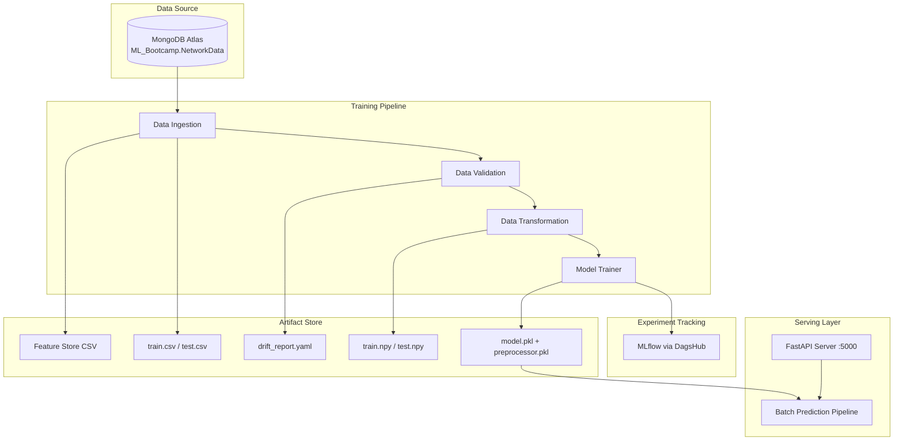
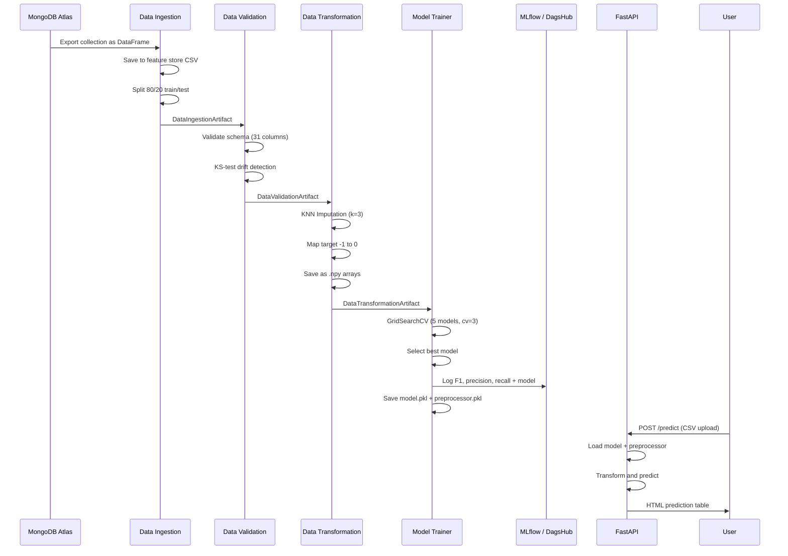

# Network Security: End-to-End Phishing Detection MLOps Pipeline

> **A production-grade MLOps pipeline that automates phishing website detection -- from raw data ingestion out of MongoDB Atlas through model training, experiment tracking, and real-time prediction serving via a FastAPI REST API.**

## Overview

This project tackles **phishing website detection** as a binary classification problem. It takes 30 URL/domain/content features extracted from websites and predicts whether a site is **legitimate (1)** or **phishing (0)**.

Instead of a monolithic Jupyter notebook approach, the entire ML lifecycle is decomposed into modular, versioned pipeline stages with proper artifact management, experiment tracking, and serving infrastructure.

### Key Capabilities
- **Automated 4-Stage Pipeline**: Data flows from MongoDB through ingestion, validation, transformation, and model training without manual intervention.
- **Multi-Model Evaluation**: 5 classifiers (Logistic Regression, Decision Tree, Random Forest, Gradient Boosting, AdaBoost) are trained and compared via GridSearchCV.
- **Experiment Tracking**: Every training run logs metrics (F1, precision, recall) and model artifacts to MLflow via DagsHub.
- **Data Drift Detection**: Kolmogorov-Smirnov statistical tests automatically flag distribution shifts between train and test sets.
- **REST API Serving**: Upload a CSV and get predictions rendered as an HTML table, or trigger retraining on demand.

## Technical Architecture



## Tech Stack

| Component | Technology |
| :--- | :--- |
| **Language** | Python 3.13+ |
| **Package Manager** | uv |
| **ML Framework** | scikit-learn (classifiers, GridSearchCV, KNN Imputer) |
| **Data** | pandas, NumPy |
| **Database** | MongoDB Atlas (pymongo) |
| **Experiment Tracking** | MLflow + DagsHub |
| **API** | FastAPI + Uvicorn |
| **Templating** | Jinja2 |
| **Containerization** | Docker (python:3.13-slim) |
| **Linting** | Ruff |

## Pipeline Stages

### Stage 1: Data Ingestion
Exports the `NetworkData` collection from MongoDB Atlas into a pandas DataFrame, saves the full dataset to a feature store CSV, and splits into **80/20 train/test sets**.

### Stage 2: Data Validation
Validates the ingested data against a predefined schema (`data_schema/schema.yaml`) with three checks:
- **Column count** matches the expected 31 columns
- **All numerical columns** are present
- **Statistical drift detection** using the Kolmogorov-Smirnov test (p-value threshold: 0.05) across every feature

Produces a per-column drift report saved as YAML.

### Stage 3: Data Transformation
- Separates features from the `Result` target column
- Maps target values from `-1` (phishing) to `0` for standard binary classification
- Applies **KNN Imputation** (`n_neighbors=3`, `weights="uniform"`) to handle missing values
- Outputs transformed data as `.npy` arrays and persists the preprocessing pipeline as `preprocessing.pkl`

### Stage 4: Model Training
Trains and evaluates 5 classifiers with hyperparameter tuning:

| Model | Tuned Hyperparameters |
| :--- | :--- |
| Logistic Regression | -- |
| Decision Tree | `criterion` |
| Random Forest | `n_estimators` |
| Gradient Boosting | `learning_rate`, `subsample`, `n_estimators` |
| AdaBoost | `learning_rate`, `n_estimators` |

The best model is selected, evaluated for F1/precision/recall on both train and test sets, logged to **MLflow via DagsHub**, and saved alongside the preprocessor for serving.

## Data Flow



## API Endpoints

| Endpoint | Method | Description |
| :--- | :--- | :--- |
| `/` | GET | Redirects to Swagger docs (`/docs`) |
| `/train` | GET | Triggers the full training pipeline |
| `/predict` | POST | Accepts a CSV upload, returns predictions as an HTML table |

### Prediction Example
```bash
curl -X POST "http://localhost:5000/predict" \
  -F "file=@data/phisingData.csv"
```

## Dataset

The dataset contains **30 features** extracted from website characteristics, plus a binary target:

| Category | Features |
| :--- | :--- |
| **URL-based** | `having_IP_Address`, `URL_Length`, `Shortining_Service`, `Prefix_Suffix`, `having_At_Symbol` |
| **Domain-based** | `having_Sub_Domain`, `Domain_registeration_length`, `age_of_domain`, `DNSRecord` |
| **Security** | `SSLfinal_State`, `HTTPS_token` |
| **Content-based** | `Request_URL`, `URL_of_Anchor`, `Links_in_tags`, `SFH`, `Iframe` |
| **Behavioral** | `on_mouseover`, `RightClick`, `popUpWidnow`, `Redirect`, `Submitting_to_email` |
| **Reputation** | `web_traffic`, `Page_Rank`, `Google_Index`, `Statistical_report` |
| **Target** | `Result` -- `-1` (phishing) / `1` (legitimate) |

---

<div align="center">
  <sub>Created with <a href="https://markdrop.vercel.app">Markdrop</a> | <a href="https://github.com/rakheOmar/Markdrop">⭐ Star on GitHub</a></sub>
</div>
